# Refactor-Udagram-App-into-Microservices-and-Deploy

## /feed and /user backends are separated into independent projects:

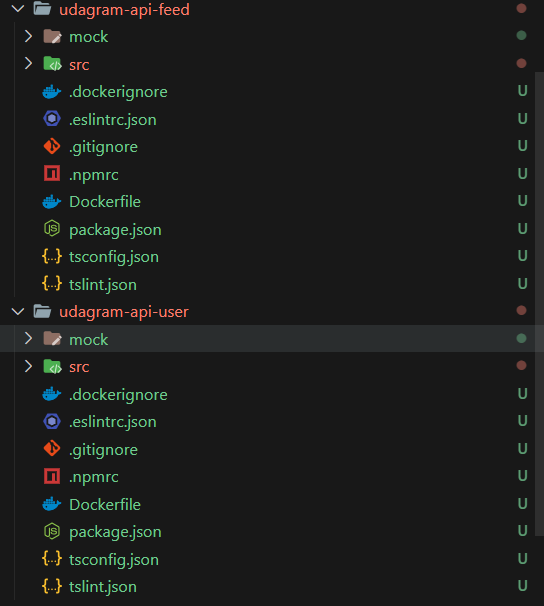

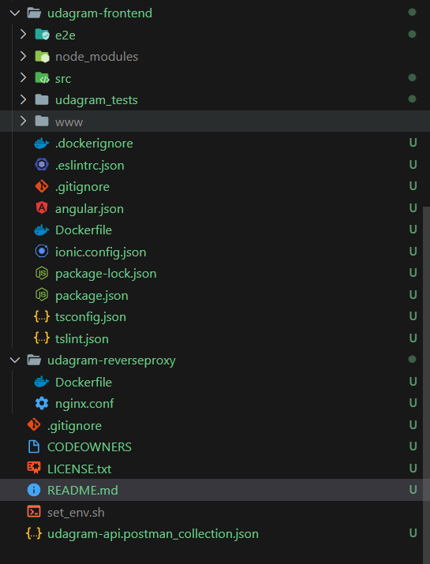

## Project includes Dockerfiles to successfully create Docker images for /feed, /user backends, project frontend, and reverse proxy:

### Create images successfully from Dockerfiles include:

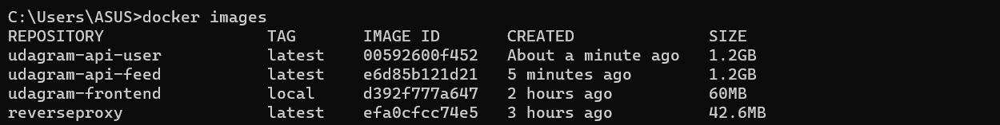

### And run containers from images:

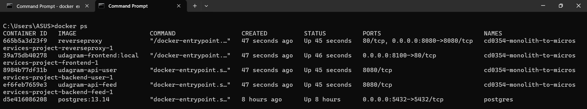

### On browser:

-FE:

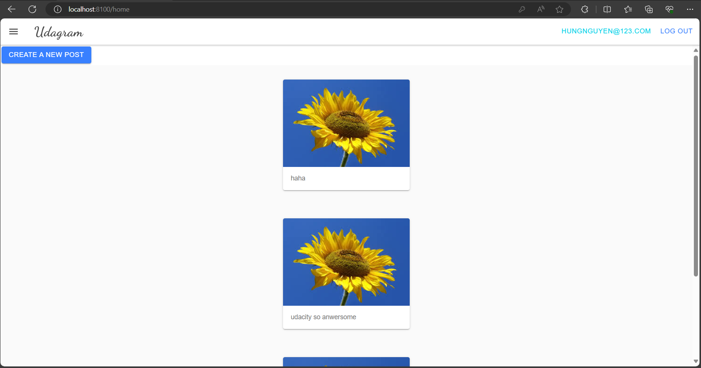

-BE: 

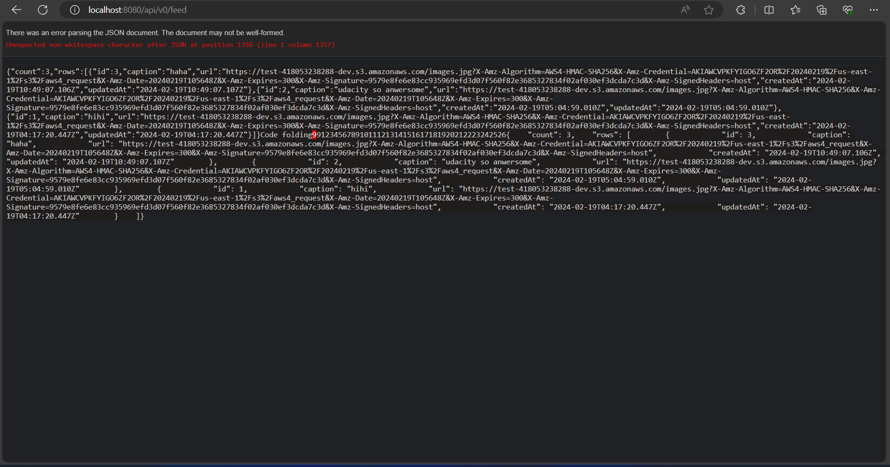

### Screenshot of DockerHub shows the images using CircleCI to run CI/CD instead of TravisCI:

- Screenshot of DockerHub shows the images: 

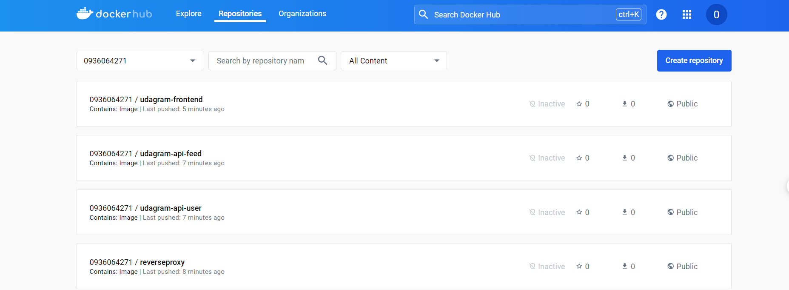

#### Can access repo docker hub through public url:

-  udagram-frontend : https://hub.docker.com/r/0936064271/udagram-frontend
-  udagram-reverseproxy : https://hub.docker.com/r/0936064271/reverseproxy
-  udagram-udagram-api-feed : https://hub.docker.com/r/0936064271/udagram-api-feed
-  udagram-udagram-api-user : https://hub.docker.com/r/0936064271/udagram-api-user

- CircleCI showing a successful build job:

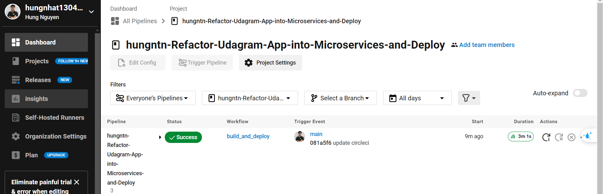

## A screenshots of kubectl commands show the Frontend and API projects deployed in Kubernetes:

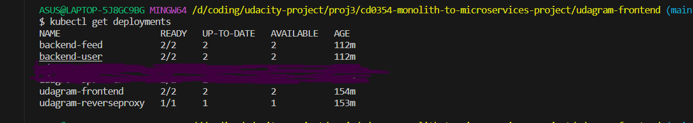

## The output of kubectl get pods indicates that the pods are running successfully with the STATUS value Running:

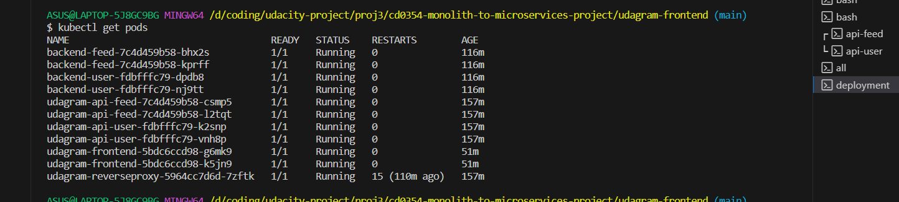

## The output of kubectl describe services:

- backend-feed:

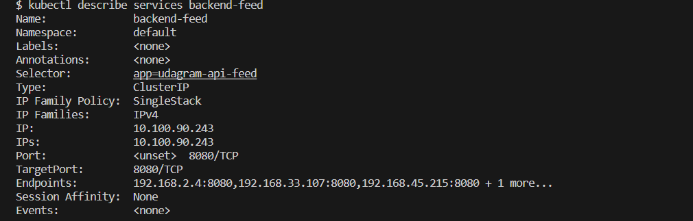

- backend-user:

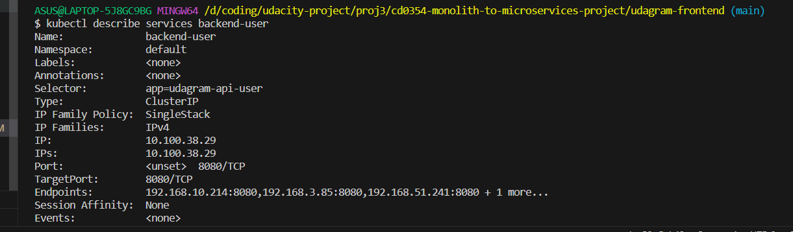

- publicfrontend:

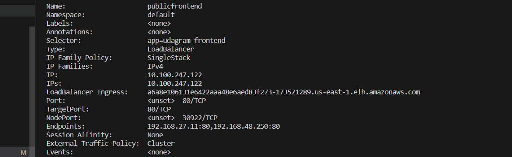

- publicreverseproxy:

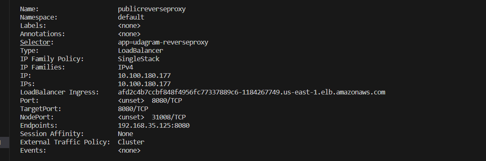

- kubectl get svc:

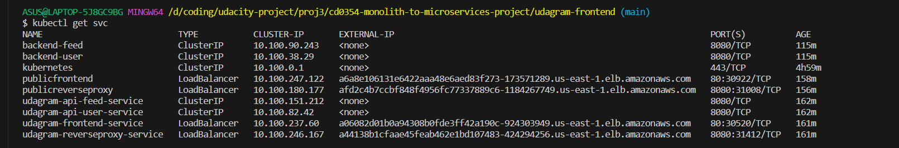

## Kubernetes services are replicated. At least one of the Kubernetes services has replicas: defined with a value greater than 1 in itsdeployment.yml file:

- api-feed-deployment:

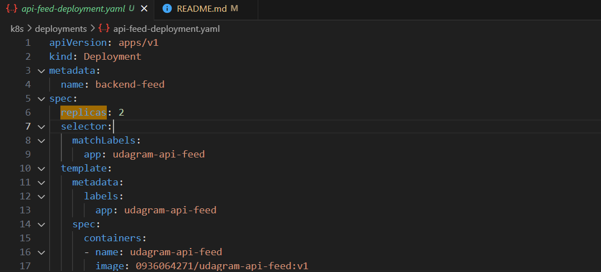

- api-user-deployment:

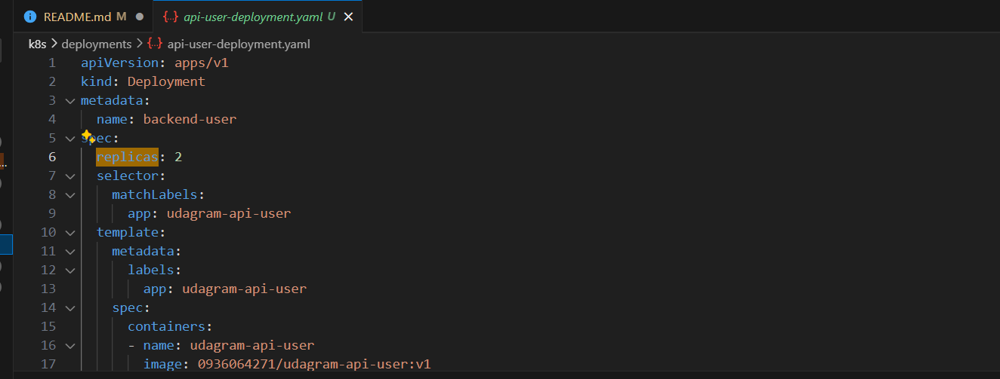

- frontend-deployment:

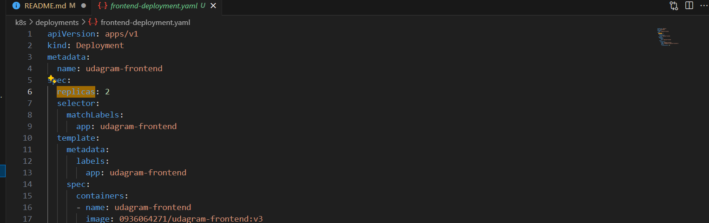

- reverseproxy-deployment:

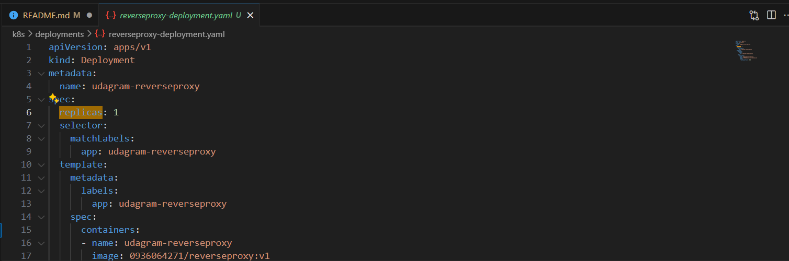

## Screenshot of Kubernetes cluster of command kubectl describe hpa has autoscaling configured with CPU metrics:

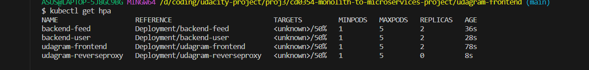